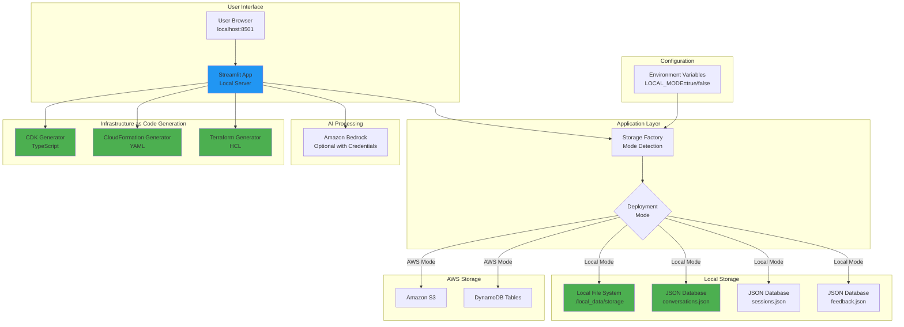
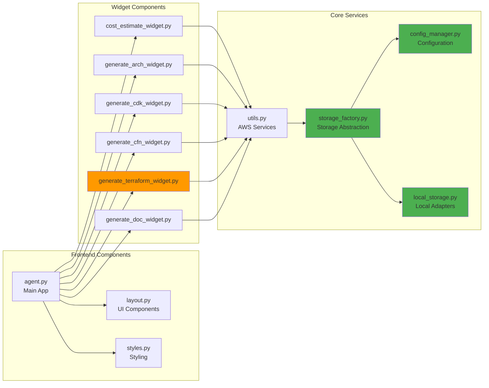

# DevGenius - AWS Solution Generator

DevGenius is an AI-powered application that transforms project ideas into complete, ready-to-deploy AWS solutions. It leverages Amazon Bedrock and Claude AI models to provide architecture diagrams, cost estimates, infrastructure as code, and comprehensive technical documentation.


## 🌟 Overview

**Conversational Solution Architecture Building:** DevGenius enables customers to design solution architectures in a conversational manner. Users can create architecture diagrams (in draw.io format) and refine them interactively. Once the design is finalized, they can generate end-to-end code automation using AWS CDK, CloudFormation, or Terraform templates, and deploy it in their AWS account with a single click. Additionally, customers can receive cost estimates for running the architecture in production, along with detailed documentation for the solution.

**Build Solution Architecture from Whiteboard Drawings:** For customers who already have their architecture in image form (e.g., whiteboard drawings), DevGenius allows them to upload the image. Once uploaded, DevGenius analyzes the architecture and provides a detailed explanation. Customer can then refine the design conversationally and, once finalized, generate end-to-end code automation using AWS CDK, CloudFormation, or Terraform. Cost estimates and comprehensive documentation are also available.

## 🎯 Features

- **Solution Architecture Generation**: Create AWS architectures based on your project requirements
- **Architecture Diagram Creation**: Generate visual representations of your AWS solutions in draw.io format
- **Infrastructure as Code**: Generate AWS CDK (TypeScript), CloudFormation (YAML), and Terraform (HCL) templates
- **Cost Estimation**: Get detailed cost breakdowns for all proposed AWS services
- **Technical Documentation**: Generate comprehensive documentation for your solutions
- **Existing Architecture Analysis**: Upload and analyze existing architecture diagrams
- **Local Development Mode**: Run without full AWS infrastructure for development and testing

## 🏗️ Architecture

### AWS Deployment Mode

```mermaid
graph TB
    subgraph "User Interface"
        A[User Browser] --> B[CloudFront Distribution]
        B --> C[Lambda@Edge<br/>Authentication]
    end

    subgraph "Application Layer"
        C --> D[Application Load Balancer]
        D --> E[ECS Fargate<br/>Streamlit App]
    end

    subgraph "AI & Processing"
        E --> F[Amazon Bedrock<br/>Claude Models]
        E --> G[Bedrock Agent Runtime]
        G --> H[Knowledge Base<br/>AWS Documentation]
    end

    subgraph "Data Storage"
        E --> I[Amazon S3<br/>Generated Artifacts]
        E --> J[DynamoDB<br/>Conversations]
        E --> K[DynamoDB<br/>Sessions]
        E --> L[DynamoDB<br/>Feedback]
    end

    subgraph "Vector Search"
        H --> M[OpenSearch Serverless<br/>Vector Embeddings]
    end

    subgraph "Authentication"
        C --> N[Amazon Cognito<br/>User Pool]
        N --> O[Identity Pool]
    end

    subgraph "Infrastructure as Code Generation"
        E --> P[CDK Generator<br/>TypeScript]
        E --> Q[CloudFormation Generator<br/>YAML]
        E --> R[Terraform Generator<br/>HCL]
    end

    style E fill:#ff9900
    style F fill:#ff9900
    style I fill:#ff9900
    style J fill:#ff9900
    style P fill:#4CAF50
    style Q fill:#4CAF50
    style R fill:#4CAF50
```

### Local Development Mode



### Component Architecture



## 📋 Prerequisites

### For AWS Deployment
- AWS Account with appropriate permissions
- AWS CLI configured with credentials
- Node.js and npm (for CDK deployment)
- Python 3.12 or later
- Docker (for container builds)
- Access to Amazon Bedrock models (Claude-3-Sonnet/Claude-3.5-Sonnet)

### For Local Development
- Docker and Docker Compose (recommended), OR
- Python 3.12 or later
- (Optional) AWS credentials for Bedrock AI features

## 🚀 Installation and Setup

### Option 1: Local Server Mode (Recommended for Development)

**Quick Start with Docker Compose:**

1. Clone the repository:
   ```bash
   git clone https://github.com/aws-samples/sample-devgenius-aws-solution-builder.git devgenius
   cd devgenius
   ```

2. Run the setup script:
   ```bash
   ./setup-local.sh
   ```

3. (Optional) Edit `.env.local` to add AWS credentials for Bedrock:
   ```bash
   nano .env.local
   ```

4. Start the application:
   ```bash
   docker-compose -f docker-compose.local.yml up
   ```

5. Access the application at `http://localhost:8501`

**Manual Setup Without Docker:**

1. Clone the repository:
   ```bash
   git clone https://github.com/aws-samples/sample-devgenius-aws-solution-builder.git devgenius
   cd devgenius/chatbot
   ```

2. Install Python dependencies:
   ```bash
   pip install -r requirements.txt
   ```

3. Set environment variables:
   ```bash
   export LOCAL_MODE=true
   export LOCAL_DATA_PATH=./local_data
   export AWS_REGION=us-west-2
   export ENABLE_AUTH=false
   ```

4. (Optional) Configure AWS credentials for Bedrock:
   ```bash
   export AWS_ACCESS_KEY_ID=your_access_key
   export AWS_SECRET_ACCESS_KEY=your_secret_key
   ```

5. Run the application:
   ```bash
   streamlit run agent.py
   ```

### Option 2: AWS Development Mode (with AWS Services)

**Prerequisites:**
- AWS account with Bedrock access
- S3 bucket created
- DynamoDB tables created
- Bedrock Agent configured

1. Clone the repository:
   ```bash
   git clone https://github.com/aws-samples/sample-devgenius-aws-solution-builder.git devgenius
   cd devgenius
   ```

2. Install dependencies:
   ```bash
   npm install
   cd chatbot
   pip install -r requirements.txt
   cd ..
   ```

3. Set environment variables:
   ```bash
   export AWS_REGION="us-west-2"
   export BEDROCK_AGENT_ID="<YOUR_AGENT_ID>"
   export BEDROCK_AGENT_ALIAS_ID="<YOUR_AGENT_ALIAS_ID>"
   export S3_BUCKET_NAME="<YOUR_BUCKET_NAME>"
   export CONVERSATION_TABLE_NAME="<YOUR_TABLE_NAME>"
   export FEEDBACK_TABLE_NAME="<YOUR_TABLE_NAME>"
   export SESSION_TABLE_NAME="<YOUR_TABLE_NAME>"
   ```

4. Run the application:
   ```bash
   streamlit run chatbot/agent.py
   ```

### Option 3: Docker Deployment (AWS Mode)

Build and run using Docker:

```bash
cd chatbot
docker build -t devgenius .
docker run -p 8501:8501 \
  -e AWS_REGION="us-west-2" \
  -e BEDROCK_AGENT_ID="<YOUR_AGENT_ID>" \
  -e BEDROCK_AGENT_ALIAS_ID="<YOUR_AGENT_ALIAS_ID>" \
  -e S3_BUCKET_NAME="<YOUR_BUCKET_NAME>" \
  -e CONVERSATION_TABLE_NAME="<YOUR_TABLE_NAME>" \
  -e FEEDBACK_TABLE_NAME="<YOUR_TABLE_NAME>" \
  -e SESSION_TABLE_NAME="<YOUR_TABLE_NAME>" \
  devgenius
```

### Option 4: Full AWS Infrastructure Deployment

DevGenius includes a CDK stack that deploys all required infrastructure:

1. Install the CDK toolkit:
   ```bash
   npm install -g aws-cdk
   ```

2. Install dependencies:
   ```bash
   npm install
   ```

3. Bootstrap the account (if not already done):
   ```bash
   cdk bootstrap
   ```

4. Deploy the stack:
   ```bash
   cdk deploy --all --context stackName=devgenius
   ```

5. Access the application URL provided in the CDK output (named `StreamlitUrl`)

6. To destroy the infrastructure when no longer needed:
   ```bash
   cdk destroy --all --context stackName=devgenius
   ```

**The CDK stack deploys:**
- VPC with public/private subnets
- ECS Fargate service with Streamlit container
- Application Load Balancer
- CloudFront distribution with Lambda@Edge for authentication
- Cognito user pool and identity pool
- DynamoDB tables for conversation tracking
- S3 bucket for storing generated assets
- Bedrock Agent with Knowledge Base
- OpenSearch Serverless collection for vector embeddings

## 📖 Usage Guide

### Authentication

**AWS Mode:**
1. Access the application URL provided in the CDK output
2. Create a new user account or sign in with existing credentials
3. Accept the terms and conditions

**Local Mode:**
- No authentication required by default
- Can be enabled by setting `ENABLE_AUTH=true`

### Building a New Solution

1. Navigate to the "Build a solution" tab
2. Select a topic (Data Lake, Log Analytics) or describe your requirements
3. Answer the discovery questions about your requirements
4. Review the generated solution
5. Use the option tabs to generate additional assets:
   - **Cost Estimates**: Get detailed pricing breakdown
   - **Architecture Diagram**: Visual representation in draw.io format
   - **CDK Code**: TypeScript infrastructure as code
   - **CloudFormation Code**: YAML templates for AWS
   - **Terraform Code**: HCL configuration files
   - **Technical Documentation**: Comprehensive solution documentation

### Analyzing Existing Architecture

1. Navigate to the "Modify your existing architecture" tab
2. Upload an architecture diagram image (PNG/JPG format)
3. The application will analyze the diagram and provide insights
4. Use the option tabs to generate modifications and improvements

### Downloading Generated Artifacts

1. After generating your solutions, click the "Download artifacts" button
2. A ZIP file will be created containing:
   - Transcript of the conversation
   - All generated code (CDK, CloudFormation, Terraform)
   - Architecture diagrams
   - Documentation
   - Cost estimates

## 🔧 Key Components

### Bedrock Agent and Knowledge Base

DevGenius uses Amazon Bedrock Agents with a custom Knowledge Base containing AWS documentation, whitepapers, and blogs. The agent is configured with specialized prompts to generate AWS solutions following best practices.

**Knowledge base sources include:**
- AWS Well-Architected Analytics Lens
- AWS Whitepapers on data streaming and analytics architectures
- AWS documentation on data lakes
- AWS architecture blog posts
- AWS service announcements

### Vector Search with OpenSearch Serverless

Architecture information is stored as vector embeddings in Amazon OpenSearch Serverless, enabling semantic search and retrieval of relevant architectural patterns.

### Infrastructure as Code Generation

The application can generate infrastructure as code in multiple formats for deploying the proposed solutions:

- **AWS CDK (TypeScript)**: Type-safe infrastructure using familiar programming constructs with built-in best practices
- **CloudFormation (YAML)**: Native AWS templates for direct deployment via AWS Console or CLI
- **Terraform (HCL)**: Declarative configuration files for multi-cloud compatibility and GitOps workflows

Each format has its advantages:
- Use **CDK** for type-safe, programmatic infrastructure with testing capabilities
- Use **CloudFormation** for native AWS integration and direct console deployment
- Use **Terraform** for multi-cloud support, state management, and infrastructure versioning

## 📁 Project Structure

```
sample-devgenius-aws-solution-builder/
├── chatbot/                          # Application code
│   ├── agent.py                      # Main Streamlit application entry point
│   ├── layout.py                     # UI layout and navigation components
│   ├── styles.py                     # CSS styling for the application
│   ├── utils.py                      # AWS service utilities and helpers
│   ├── config_manager.py             # Configuration management (AWS/Local mode)
│   ├── storage_factory.py            # Storage abstraction layer
│   ├── local_storage.py              # Local storage adapters (S3/DynamoDB alternatives)
│   │
│   ├── Widget Components/
│   ├── cost_estimate_widget.py       # Cost estimation generation
│   ├── generate_arch_widget.py       # Architecture diagram generation
│   ├── generate_cdk_widget.py        # AWS CDK code generation
│   ├── generate_cfn_widget.py        # CloudFormation template generation
│   ├── generate_terraform_widget.py  # Terraform configuration generation
│   ├── generate_doc_widget.py        # Technical documentation generation
│   │
│   ├── dynamodb.py                   # DynamoDB operations
│   ├── upload.py                     # File upload handling
│   ├── Dockerfile                    # Container definition
│   └── requirements.txt              # Python dependencies
│
├── lib/                              # CDK infrastructure code
│   ├── lambda/                       # Lambda function code
│   │   ├── kb_ds.py                  # Knowledge base data source
│   │   ├── oss_index.py              # OpenSearch indexing
│   │   └── prefix_list.py            # IP prefix management
│   ├── edge-lambda/                  # CloudFront Lambda@Edge
│   └── layer/                        # Lambda layers with dependencies
│
├── demo/                             # Demo assets
│   └── DevGenius_Demo.gif           # Application demo
│
├── Configuration Files/
├── .env.local.example                # Local mode configuration template
├── docker-compose.local.yml          # Docker Compose for local development
├── setup-local.sh                    # Local setup automation script
├── package.json                      # Node.js dependencies (for CDK)
├── tsconfig.json                     # TypeScript configuration
├── cdk.json                          # CDK configuration
├── .gitignore                        # Git ignore rules
└── README.md                         # This file
```

## 🔄 Local Mode vs AWS Mode

### Local Development Mode

**Enabled Features:**
- ✅ Infrastructure as Code generation (CDK, CloudFormation, Terraform)
- ✅ Architecture diagram generation
- ✅ Technical documentation generation
- ✅ Cost estimation (if Bedrock available)
- ✅ Local file storage for generated artifacts
- ✅ Local JSON-based database for conversations
- ✅ No authentication required (simplified for local use)
- ✅ Amazon Bedrock AI (if AWS credentials provided)

**Limitations:**
- ⚠️ Bedrock Agent features require AWS credentials
- ⚠️ No CloudFront distribution
- ⚠️ No Cognito authentication (disabled by default)
- ⚠️ Knowledge Base features may be limited without full AWS setup

**Data Storage in Local Mode:**
All data is stored locally in the `local_data` directory:
- `local_data/storage/` - Generated artifacts (CDK, CFN, Terraform, diagrams)
- `local_data/conversations.json` - Conversation history
- `local_data/sessions.json` - Session information
- `local_data/feedback.json` - User feedback

### AWS Deployment Mode

**Full Features:**
- ✅ All local mode features
- ✅ Bedrock Agent with Knowledge Base
- ✅ Vector search with OpenSearch Serverless
- ✅ CloudFront CDN distribution
- ✅ Cognito user authentication
- ✅ S3 for scalable artifact storage
- ✅ DynamoDB for conversation tracking
- ✅ Lambda@Edge for edge authentication
- ✅ Multi-user support with session management

## 🔐 Security

DevGenius includes several security features:

- **Authentication**: Amazon Cognito for user management (AWS mode)
- **Edge Security**: CloudFront with Lambda@Edge for request validation
- **Access Control**: IAM roles with least privilege permissions
- **Network Isolation**: VPC with security groups for resource protection
- **Encryption at Rest**: S3 bucket encryption for asset storage
- **Encryption at Rest**: DynamoDB table encryption for data storage
- **Secure Communications**: HTTPS/TLS for all data in transit
- **Input Validation**: Defused XML parsing to prevent injection attacks

## 🐛 Troubleshooting

### Common Issues

**Issue**: Application won't start in local mode
- **Solution**: Check that `LOCAL_MODE=true` is set and `local_data` directory exists
- Run: `./setup-local.sh` to create necessary directories

**Issue**: Bedrock errors in local mode
- **Solution**: Verify AWS credentials are configured correctly
- Check: `aws bedrock list-foundation-models --region us-west-2`

**Issue**: Docker container exits immediately
- **Solution**: Check environment variables are set correctly
- View logs: `docker-compose -f docker-compose.local.yml logs`

**Issue**: Can't access application at localhost:8501
- **Solution**: Check if port 8501 is already in use
- Try: `docker-compose -f docker-compose.local.yml down` then start again

## 🤝 Contributing

Contributions are welcome! Please feel free to submit a Pull Request.

## 📄 License

Copyright Amazon.com, Inc. or its affiliates. All Rights Reserved.

This library is licensed under the MIT-0 License. See the LICENSE file.

## 🙏 Acknowledgments

- Built with [Streamlit](https://streamlit.io/)
- Powered by [Amazon Bedrock](https://aws.amazon.com/bedrock/)
- Uses [Claude AI](https://www.anthropic.com/claude) models by Anthropic
- Infrastructure automation with [AWS CDK](https://aws.amazon.com/cdk/)

## 📞 Support

For issues, questions, or contributions:
- Open an issue in the GitHub repository
- Contact AWS Support for AWS-specific issues
- Review AWS documentation for Bedrock and related services

---

**Made with ❤️ by the AWS Solutions Architecture team**
